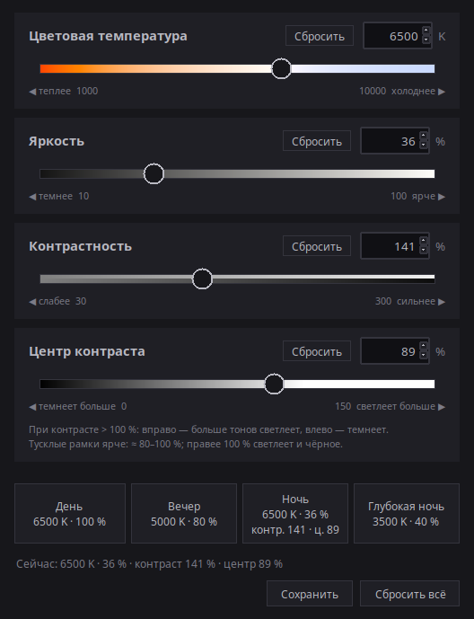
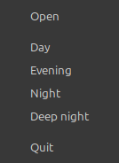

# Night Screen

**English** · [中文](README.zh.md) · [Русский](README.ru.md)

A small GUI for Linux (X11) to dim and warm your screen at night: color
temperature (1000–10000 K), brightness (10–100 %), contrast (30–300 %) and the
contrast pivot (0–150 %). It changes the GPU gamma ramp and leaves the monitor
backlight alone, so you avoid the PWM flicker that cheap monitors show at low
hardware brightness.



The interface is available in English (default), Chinese and Russian. Pick the
language with the flag buttons in the top right corner of the window; the choice is
remembered in `~/.config/night-screen/settings.json` and also applies to the tray menu.

## Run

```sh
git clone https://github.com/antoh1986/night-screen.git
cd night-screen
./run.sh
```

Requirements: Python 3 with tkinter, plus libX11 and libXrandr (present by default
on Linux Mint). `xsct` is optional: it is only used at startup to read the current
values if the screen was changed from outside this window.

For the tray icon you also need the system Python with GTK bindings and XApp:

```sh
sudo apt install python3-gi gir1.2-gtk-3.0 gir1.2-xapp-1.0
```

Without them the window works as before; closing it quits the app.

## Usage

- Sliders: mouse, wheel, arrow keys (one step), PageUp/PageDown (×10). Entry
  fields: type a number and press Enter; out-of-range values are clamped.
- Presets (Day / Evening / Night / Deep night) change only temperature and
  brightness by default. "Save" at the bottom stores all four current values in a
  preset: the presets light up and blink, the rest of the window is greyed out, and a
  click on a preset saves into it. Esc or "Cancel" leaves this mode. Saved presets live in `~/.config/night-screen/presets.json`;
  delete it to get the defaults back.
- "Reset all" restores everything: 6500 K, 100 %, contrast 100 %, pivot 50 %. Each
  slider also has its own "Reset" button for just that value.
  To restore the screen from a terminal: `xsct 6500 1`.
- Contrast is a slope around the pivot. Above 100 %, tones darker than the pivot get
  darker and lighter ones get lighter (extremes are clipped); below 100 %,
  everything is pulled toward the pivot. Brightness and temperature are applied
  after contrast, so brightness can always dim even a very contrasty picture.
- Pivot: right means more tones get lighter, left means more get darker (like the
  track color). To make dim borders brighter instead of vanishing, use about
  80–100 %.
- Settings stay after the window is closed (`~/.config/night-screen/state.json`).
  If the screen differs from them at startup (after a reboot or an `xsct` call),
  the window shows the real state.

## Tray

Left click opens the window; right click opens a menu with the presets
(Day / Evening / Night / Deep night), "Open" and "Quit". The
window's close button only hides it to the tray; quit from the menu. Starting
`./run.sh` again just brings up the running window, and `./run.sh --tray` starts
hidden. A preset picked from the tray applies exactly as the button in the window.



### Start at login

Copy [night-screen.desktop.example](night-screen.desktop.example) to
`~/.config/autostart/night-screen.desktop` and fix the paths in it. To disable
autostart, delete that file.

Autostart only puts the icon in the tray: **after a reboot the screen is neutral
again** until you pick a preset or open the window. This is not a bug; the app does
not apply anything at login on its own.

## Limitations

- X11 only: XRandR gamma control does not exist on Wayland.
- The setting is applied to all connected monitors at once.
- Other programs that change gamma (Redshift, Cinnamon's night mode, etc.) fight
  with this one over the same ramp. I have not tested this; if colors jump around,
  turn the other one off.
- The tray was tested only on Cinnamon (Linux Mint).

## How it works

Only the gamma table of the GPU is written (via XRandR, with ctypes); the monitor
backlight is not touched. Order: contrast, then brightness, then temperature.

The pivot slider is inverted inside: the gray level that contrast leaves untouched
is 100 % − slider value, so it can be negative. Past 100 % the pivot goes below
black: black starts to lift, and very dim tones are pulled up even harder (at 150
with contrast 150 %, black rises to 25 %). At 100 contrast is plain amplification
(black stays black); at 0 everything darkens (white stays white).

## Files

- `night_screen.py`: the window; limits and presets are at the top.
- `i18n.py`: all interface texts (English, Chinese, Russian). `flags/`: the flag
  pictures (`make_flags.py` redraws them; it needs Pillow, the app does not).
- `gamma.py`: writes the gamma ramp (at contrast 100 % it matches `xsct` exactly).
- `tray.py`, `ipc.py`: the tray icon (a separate process) and the single-instance
  socket it talks to the window through.
- `run.sh`: launcher. `night-screen.desktop.example`: autostart template.
- `AGENTS.md`: short project map (in Russian).

## License

[MIT](LICENSE)
