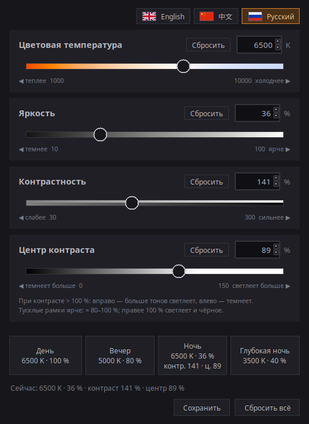
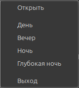

# Night Screen

[English](README.md) · [中文](README.zh.md) · **Русский**

Небольшая программа для Linux (X11), чтобы ночью приглушить и «согреть» экран:
цветовая температура (1000–10000 K), яркость (10–100 %), контраст (30–300 %) и
центр контраста (0–150 %). Меняется гамма-таблица видеокарты, подсветка монитора не
трогается, поэтому ШИМ-мерцание дешёвых мониторов на низкой аппаратной яркости не
появляется.



Интерфейс есть на английском (по умолчанию), китайском и русском. Язык выбирается
кнопками с флагами в правом верхнем углу окна; выбор запоминается в
`~/.config/night-screen/settings.json` и действует и на меню в трее.

## Запуск

```sh
git clone https://github.com/antoh1986/night-screen.git
cd night-screen
./run.sh
```

Нужен Python 3 с tkinter и библиотеки libX11/libXrandr (в Linux Mint есть по
умолчанию). `xsct` не обязателен: он нужен только чтобы при запуске узнать текущие
значения, если экран изменили не из этого окна.

Для значка в трее нужен системный Python с GTK и XApp:

```sh
sudo apt install python3-gi gir1.2-gtk-3.0 gir1.2-xapp-1.0
```

Без них окно работает по-старому: крестик закрывает приложение.

## Использование

- Ползунки: мышь, колесо, стрелки (шаг), PageUp/PageDown (×10). Поля ввода: число
  и Enter; значение за пределами зажимается в диапазон.
- Пресеты (День/Вечер/Ночь/Глубокая ночь) по умолчанию меняют только температуру
  и яркость. «Сохранить» внизу записывает в пресет все четыре текущих значения:
  пресеты подсвечиваются и мигают, остальное окно блекнет, клик по пресету
  сохраняет в него. Выйти из режима — Esc или «Отмена». Сохранённые пресеты лежат
  в `~/.config/night-screen/presets.json`; удалить файл — вернутся стандартные.
- «Сбросить всё» возвращает всё: 6500 K, 100 %, контраст 100 %, центр 50 %. У
  каждого ползунка есть своя «Сбросить»: она возвращает только это значение.
  Вернуть экран из терминала (когда приложение не запущено): `xsct 6500 1`.
- Пока приложение запущено, оно держит свою гамма-таблицу: если её переписала другая
  программа (ночной режим рабочего стола, redshift, `xsct`), через полсекунды
  записывается своя. Встроенный ночной режим лучше выключить, чтобы они не спорили,
  например в Cinnamon: `gsettings set org.cinnamon.settings-daemon.plugins.color night-light-enabled false`.
- Контраст — наклон вокруг центра. Выше 100 %: тона темнее центра темнеют, светлее —
  светлеют (крайние обрезаются); ниже 100 %: всё стягивается к центру. Яркость и
  температура применяются после контраста, поэтому яркостью можно притушить даже
  очень контрастную картинку.
- Центр контраста: вправо — светлеет больше тонов, влево — темнеет больше (как цвет
  дорожки). Чтобы тусклые рамки становились ярче, а не исчезали, — ≈ 80–100 %.
- Настройки остаются после закрытия окна (`~/.config/night-screen/state.json`).
  Если экран при запуске отличается от них (после перезагрузки, после `xsct`), окно
  показывает реальное состояние.

## Трей

Левая кнопка открывает окно, правая — меню с пресетами
(День/Вечер/Ночь/Глубокая ночь), «Открыть» и «Выход». Крестик окна только прячет его
в трей, закрыть приложение можно через «Выход». Повторный `./run.sh` просто
показывает уже запущенное окно, а `./run.sh --tray` запускает его скрытым. Пресет из
трея применяется так же, как кнопка в окне.



### Автозапуск при входе

Скопируйте [night-screen.desktop.example](night-screen.desktop.example) в
`~/.config/autostart/night-screen.desktop` и поправьте в нём пути. Чтобы отключить
автозапуск, удалите этот файл.

Автозапуск только кладёт значок в трей: **после перезагрузки экран снова
нейтральный**, пока вы не выберете пресет или не откроете окно. Это не баг:
приложение само ничего не применяет при входе.

## Ограничения

- Только X11: на Wayland управления гаммой через XRandR нет.
- Настройка применяется сразу ко всем подключённым мониторам.
- Другие программы, меняющие гамму (Redshift, ночной режим Cinnamon и т. п.), будут
  спорить с этой за одну и ту же таблицу. Я это не проверял; если цвета скачут,
  выключите другую.
- Трей проверялся только на Cinnamon (Linux Mint).

## Как это работает

Пишется только гамма-таблица видеокарты (через XRandR, ctypes); подсветка монитора
не трогается. Порядок: контраст, затем яркость, затем температура.

Ползунок центра контраста внутри инвертирован: уровень серого, который контраст не
трогает, = 100 % − значение ползунка (бывает и отрицательным). Правее 100 центр
уходит ниже чёрного: чёрный начинает светлеть, а совсем тусклые тона тянутся вверх
ещё сильнее (на 150 при контрасте 150 % чёрный поднимается до 25 %). На 100 —
простое усиление (чёрный остаётся), на 0 — всё темнеет (белый остаётся).

## Файлы

- `night_screen.py` — окно; пределы и пресеты в его начале.
- `i18n.py` — все тексты интерфейса (английский, китайский, русский). `flags/` —
  картинки флагов (`make_flags.py` их перерисовывает; ему нужен Pillow, самой
  программе — нет).
- `gamma.py` — запись гамма-таблицы (при контрасте 100 % совпадает с `xsct`).
- `tray.py`, `ipc.py` — значок в трее (отдельный процесс) и сокет «один экземпляр»,
  через который он говорит с окном.
- `run.sh` — запуск. `night-screen.desktop.example` — шаблон автозапуска.
- `AGENTS.md` — краткая карта проекта.

## Лицензия

[MIT](LICENSE)
