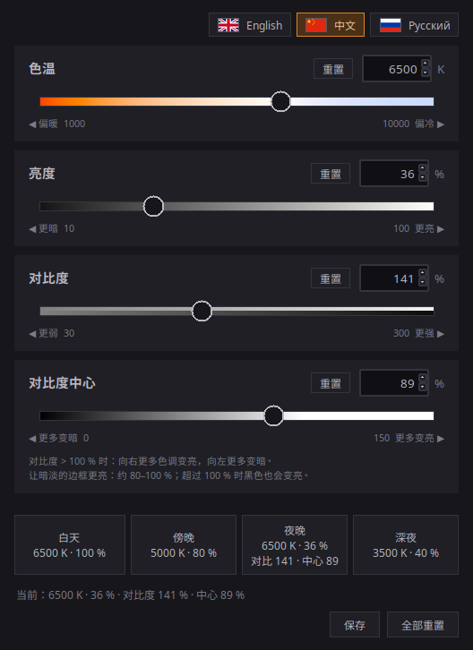
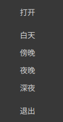

# Night Screen

[English](README.md) · **中文** · [Русский](README.ru.md)

一个用于 Linux（X11）的小型图形工具，让屏幕在夜间变暗、变暖：色温（1000–10000 K）、
亮度（10–100 %）、对比度（30–300 %）和对比度中心（0–150 %）。它修改的是显卡的伽马表，
不碰显示器背光，因此可以避免廉价显示器在低硬件亮度下出现的 PWM 频闪。



界面支持英语（默认）、中文和俄语。用窗口右上角带国旗的按钮选择语言；选择会保存在
`~/.config/night-screen/settings.json` 中，并同样作用于托盘菜单。

## 运行

```sh
git clone https://github.com/antoh1986/night-screen.git
cd night-screen
./run.sh
```

要求：带 tkinter 的 Python 3，以及 libX11 和 libXrandr（Linux Mint 默认已有）。
`xsct` 不是必需的：它只在启动时用来读取当前值，以防屏幕是在本窗口之外被修改的。

托盘图标还需要带 GTK 绑定和 XApp 的系统 Python：

```sh
sudo apt install python3-gi gir1.2-gtk-3.0 gir1.2-xapp-1.0
```

没有它们时窗口照常工作，只是关闭窗口会退出程序。

## 使用

- 滑块：鼠标、滚轮、方向键（一步）、PageUp/PageDown（×10）。输入框：输入数字后按
  Enter；超出范围的值会被限制在范围内。
- 预设（白天 / 傍晚 / 夜晚 / 深夜）默认只改变色温和亮度。底部的“保存”会把当前的四个值
  都存入某个预设：预设按钮会亮起并闪烁，窗口其余部分变灰，点击某个预设即保存到其中。
  按 Esc 或“取消”退出该模式。保存的预设位于 `~/.config/night-screen/presets.json`；
  删除该文件即可恢复默认值。
- “全部重置”会恢复所有值：6500 K、100 %、对比度 100 %、中心 50 %。每个滑块也有自己的
  “重置”按钮，只恢复该项。在终端中恢复屏幕：`xsct 6500 1`。
- 对比度是围绕中心的斜率。高于 100 % 时，比中心暗的色调变得更暗，比中心亮的变得更亮
  （极端值被截断）；低于 100 % 时，一切都向中心收拢。亮度和色温在对比度之后应用，
  所以即使画面对比度很高，也总能用亮度把它压暗。
- 中心：向右表示更多色调变亮，向左表示更多变暗（与滑块轨道的颜色一致）。要让暗淡的边框
  变亮而不是消失，请使用约 80–100 %。
- 关闭窗口后设置仍会保留（`~/.config/night-screen/state.json`）。如果启动时屏幕与保存的
  设置不同（重启后或调用过 `xsct`），窗口会显示屏幕的真实状态。

## 托盘

左键打开窗口；右键打开菜单，其中有预设（白天 / 傍晚 / 夜晚 / 深夜）、“打开”和“退出”。
窗口的关闭按钮只会把它隐藏到托盘，要退出请用菜单。再次运行 `./run.sh` 只会唤出已在运行的
窗口，而 `./run.sh --tray` 会以隐藏状态启动。从托盘选择预设与点击窗口中的按钮效果完全一样。



### 登录时启动

把 [night-screen.desktop.example](night-screen.desktop.example) 复制到
`~/.config/autostart/night-screen.desktop`，并修改其中的路径。要禁用自启动，删除该文件即可。

自启动只会把图标放进托盘：**重启后屏幕恢复为中性状态**，直到你选择某个预设或打开窗口。
这不是 bug；程序不会在登录时自行应用任何设置。

## 限制

- 仅支持 X11：Wayland 上没有 XRandR 的伽马控制。
- 设置会同时应用到所有已连接的显示器。
- 其他会修改伽马的程序（Redshift、Cinnamon 的夜间模式等）会与本程序争用同一张伽马表。
  我没有测试过这种情况；如果颜色跳动，请关闭另一个程序。
- 托盘只在 Cinnamon（Linux Mint）上测试过。

## 工作原理

只写入显卡的伽马表（通过 XRandR 和 ctypes）；显示器背光不受影响。顺序：先对比度，
再亮度，最后色温。

对比度中心滑块在内部是反向的：对比度不改变的灰度等级等于 100 % − 滑块值，因此可以为负。
超过 100 % 后中心低于黑色：黑色开始变亮，非常暗的色调被拉得更高（滑块为 150、对比度为
150 % 时，黑色升到 25 %）。滑块为 100 时就是单纯的放大（黑色保持为黑）；为 0 时一切变暗
（白色保持为白）。

## 文件

- `night_screen.py`：窗口；限值和预设在文件开头。
- `i18n.py`：所有界面文字（英语、中文、俄语）。`flags/`：国旗图片
  （`make_flags.py` 可重新绘制，需要 Pillow，程序本身不需要）。
- `gamma.py`：写入伽马表（对比度为 100 % 时与 `xsct` 完全一致）。
- `tray.py`、`ipc.py`：托盘图标（独立进程）和“单实例”套接字，托盘通过它与窗口通信。
- `run.sh`：启动脚本。`night-screen.desktop.example`：自启动模板。
- `AGENTS.md`：简短的项目地图（俄语）。

## 许可证

[MIT](LICENSE)
